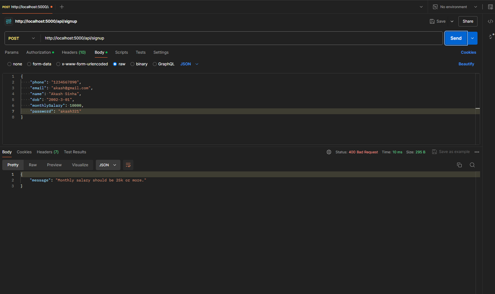
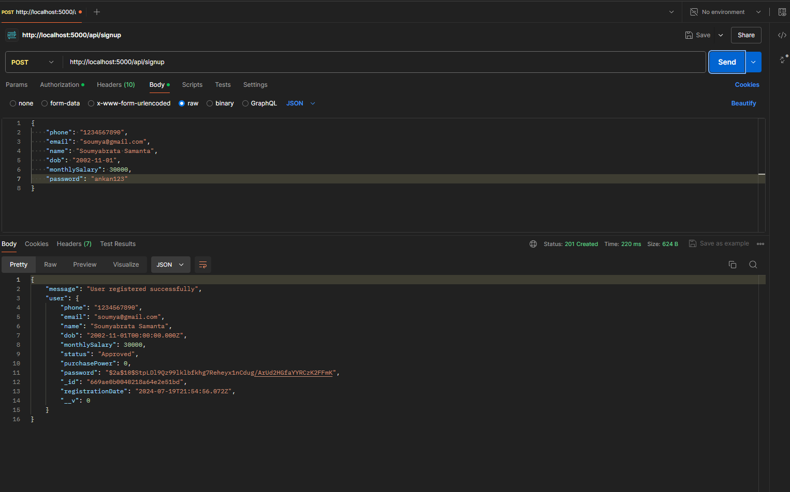
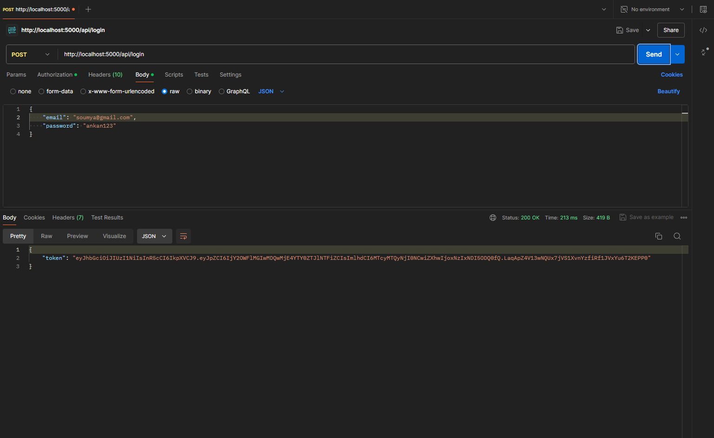
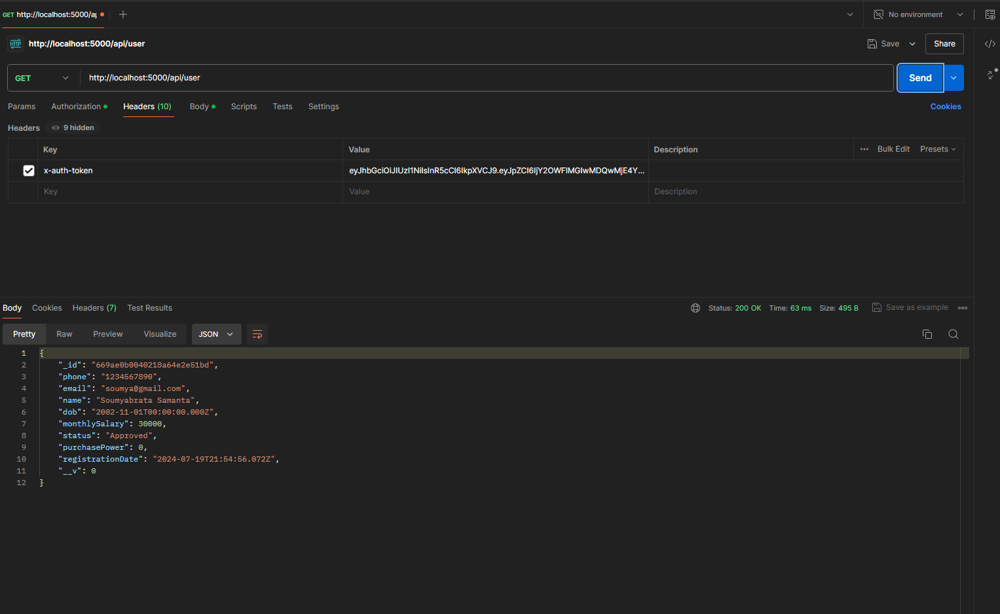
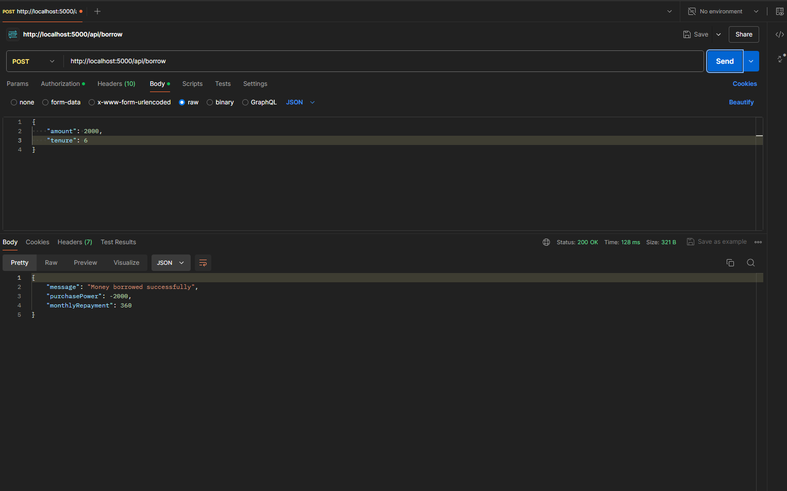

# Money Lending Application Backend

This is the backend for a money lending application using Node.js, Express, and MongoDB, and includes APIs for user signup, login, showing user data, and borrowing money.

## Features
- Approve or reject user applications based on age and monthly salary.
- User authentication using JWT.
- View user data including purchase power amount.
- Borrow money with interest rate calculation.

## Getting Started

### Prerequisites
- Node.js
- MongoDB

### Installation
1. Clone the repository:
   git clone https://github.com/soumyabrata-samanta/froker-backend.git
   cd money-lending-app
## Install the dependencies:
 - npm install

## Environment Variables
 - Create a .env file in the root of the project and add your MongoDB URI:

 - MONGO_URI= mongo-url
 - PORT=5000
 - JWT_SECRET=your_jwt_secret

## Running the Server
 - Start the server:
 - npm start

### Screenshots of API Endpoints 
1. User having monthly salary less than 25,000

3. User having age more than 20 years and having monthly salary more than 25,000
   

5. User successfully logging in
   

7. Fetching User Data
   

9. Borrowing Money
    

